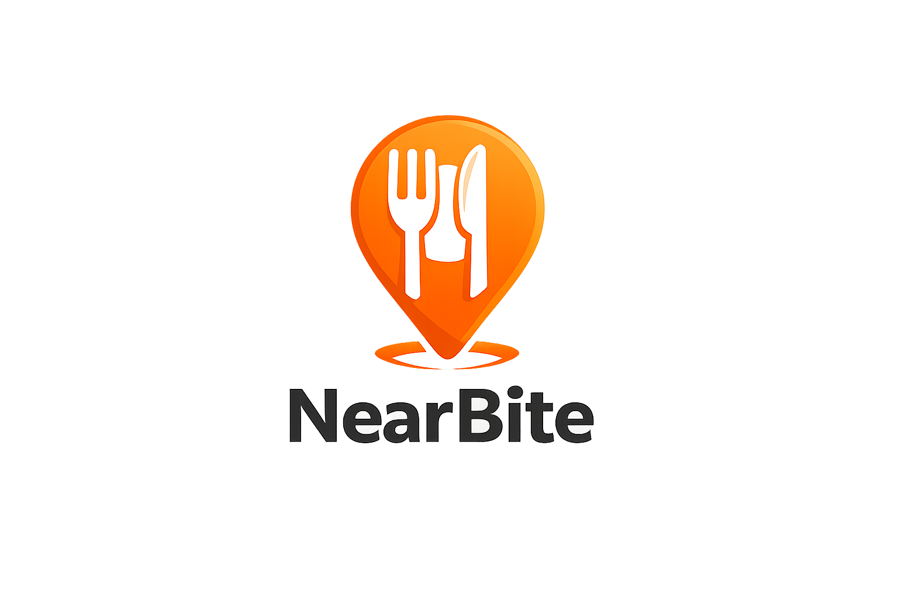

<p align="center">
  
</p>

# NearBite — Personalized NYC Restaurant Discovery

> Find your next favorite spot — by vibe, not just by stars.

NearBite is a semantic restaurant discovery app for New York City. Unlike traditional apps that rely purely on structured filters (cuisine, price, rating), NearBite lets you search the way you actually think: *"cheap spicy ramen near NYU"* or *"cozy date night spot in the East Village"*. The system combines **semantic search**, **structured filtering**, and **personalized recommendations** based on your dining history.

---

## Team

| Name | Role |
|------|------|
| Yue Li | Data pipeline & preprocessing |
| Fidaa Abdulkareem | Semantic retrieval & embeddings |
| Albee Zhou | Ranking algorithm & personalization |
| Jonas Chen | Frontend, authentication, MongoDB integration, recommendation algorithm |
| Nick Sidoti | Integration, infra & documentation |

---

## Features

- **User Authentication** — Sign up, log in, log out, and password reset flow
- **Questionnaire-Based Recommendations** — Personalized top restaurant suggestions based on onboarding answers
- **Saved Restaurants** — Logged-in users can save restaurants to their profile
- **Semantic Search** — Type natural language queries; the system matches your intent using sentence embeddings
- **Structured Filters** — Narrow by cuisine, price range ($–$$$$$), dietary restrictions, rating, neighborhood, and more
- **Personalized Ranking** — Results ranked by a combination of semantic relevance and your interaction history
- **Content-Based Recommendations** — "More like places you've liked" suggestions
- **Map View** — See results plotted geographically across NYC boroughs

---

## Repo Structure

```text
nearbite/
│
├── app.py                              # Streamlit entry point
├── requirements.txt                    # Python dependencies
├── README.md                           # Project documentation and setup instructions
├── .env.example                        # Environment variable template
│
├── data/
│   ├── pipeline.py                     # Data ingestion, cleaning, and restaurant dataset loading (Yue)
│   └── __init__.py
│
├── embeddings/
│   ├── vectorizer.py                   # Embedding model, query vectorization, cosine similarity (Fidaa)
│   ├── location_aware_vector_search.py # Location-aware semantic retrieval experiments
│   └── __init__.py
│
├── recommendation/
│   ├── algorithm.py                    # Sample: Questionnaire + wrapped-based recommendation algorithm (Jonas)
│   └── __init__.py
│
├── frontend/
│   ├── __init__.py
│   ├── ui.py                           # Main app router and global modal rendering
│   ├── theme.py                        # CSS/theme injection
│   ├── state.py                        # Session state defaults for app UI
│   ├── auth.py                         # Login, signup, logout, forgot-password state logic
│   ├── user_profile_state.py           # Questionnaire/profile session state + DB sync
│   ├── adapters.py                     # Frontend data normalization and shaping helpers
│   │
│   ├── views/
│   │   ├── __init__.py
│   │   ├── home.py
│   │   ├── discover.py                 # Search, filtering, map, restaurant browsing
│   │   ├── profile.py                  # Wrapped summary + saved restaurants + recommendation entry
│   │   └── recommendation.py           # Questionnaire flow + personalized recommendations
│   │
│   ├── components/
│   │   ├── __init__.py
│   │   ├── nav.py
│   │   ├── hero.py
│   │   ├── map_view.py
│   │   ├── location_picker.py
│   │   ├── profile_form.py
│   │   ├── onboarding_form.py          # User onboarding questionnaire form
│   │   ├── restaurant_card.py          # Restaurant result card with save/focus/comments actions
│   │   ├── comments_modal.py           # Global comments dialog
│   │   ├── login_modal.py              # Log in modal
│   │   ├── signup_modal.py             # Sign up modal
│   │   ├── forgot_password_modal.py    # Password reset modal
│   │   ├── wrapped_card.py
│   │   └── empty_state.py
│   │
│   └── assets/
│       ├── custom.css
│       ├── nearbite.svg
│       └── nearbite.png                # Optional page/tab icon
│
├── integration/
│   ├── __init__.py
│   ├── api.py                          # Glue layer: orchestrates search pipeline (Nick)
│   ├── db.py                           # MongoDB connection setup
│   ├── user_repo.py                    # MongoDB user accounts + questionnaire profile storage
│   ├── interaction_repo.py             # Saved restaurant persistence
│   └── wrapped_repo.py                 # User interaction logging + wrapped summary generation
│
├── config/
│   ├── settings.py                     # Environment variables and app-wide constants (Nick)
│   └── __init__.py
│
└── tests/
    ├── test_pipeline.py
    ├── test_vectorizer.py
    ├── test_api.py
    └── test_algorithm.py               

## Setup

### 1. Clone the repo

```bash
git clone https://github.com/JonasChenJusFox/ML_FinalProject.git
cd ML_FinalProject
```

### 2. Create and activate a virtual environment

```bash
python -m venv venv
source venv/bin/activate      # macOS / Linux
venv\Scripts\activate         # Windows
```

### 3. Install dependencies

```bash
python3 -m pip install --upgrade pip
pip install -r requirements.txt
```

### 4. Configure environment variables

```bash
cp .env.example .env
# Edit .env and add your MongoDB database username and key
```

### 5. Run the app

```bash
streamlit run app.py
```

---

## Data Sources

| Source | Used For |
|--------|----------|
| [Yelp Fusion API](https://fusion.yelp.com/) | Live restaurant metadata (name, rating, price, categories, hours). Limited to 500 req/day — responses cached locally. |
| [Google Places API](https://developers.google.com/maps/documentation/places/web-service/overview) | Live review text for sentiment analysis, semantic embedding, and vibe matching. |
| [NYC Open Data — DOHMH Restaurant Inspections](https://data.cityofnewyork.us/Health/DOHMH-New-York-City-Restaurant-Inspection-Results/43nn-pn8j/about_data) | Supplemental official restaurant registry |
| [TripAdvisor NYC Dataset (Kaggle, 10k+)](https://www.kaggle.com/datasets/rayhan32/trip-advisor-newyork-city-restaurants-dataset-10k) | Review text for vibe tag extraction and NLP training |
| [Yelp Open Dataset (Kaggle)](https://www.kaggle.com/datasets/yelp-dataset/yelp-dataset) | Sentiment analysis and embedding model training (NYC subset) |
| Synthetic user data | User interaction history for personalization development |

> ⚠️ The Kaggle Yelp NYC dataset (2004–2015) is outdated and should **not** be used as the live recommendation source. It is used only for NLP training and vibe tag extraction.

---

## Algorithm

To meet the course requirement, **cosine similarity is implemented from scratch** (no NumPy or scikit-learn) in `embeddings/vectorizer.py`:

```python
def cosine_similarity(vec1: list[float], vec2: list[float]) -> float:
    dot_product = sum(v1 * v2 for v1, v2 in zip(vec1, vec2))
    norm_vec1 = sum(v ** 2 for v in vec1) ** 0.5
    norm_vec2 = sum(v ** 2 for v in vec2) ** 0.5
    if norm_vec1 == 0 or norm_vec2 == 0:
        return 0.0
    return dot_product / (norm_vec1 * norm_vec2)
```

This drives the semantic retrieval step: every user query is embedded and ranked against all pre-computed restaurant embeddings using this function.

---

## Search Pipeline

```
User Query (natural language)
        │
        ▼
  Query Embedding          ← embeddings/vectorizer.py
        │
        ▼
Semantic Candidate Retrieval (cosine similarity, top-K)
        │
        ▼
Structured Filtering         ← recommendation/ranker.py
(price, cuisine, dietary, distance, open_now ...)
        │
        ▼
Personalized Ranking         ← recommendation/ranker.py
(semantic score + user history + popularity signal)
        │
        ▼
   Final Results Display     ← frontend/ui.py
   (ranked cards + map view)
```

---

## Tech Stack

- **Frontend**: Streamlit
- **Backend / API**: Python (Flask integration layer planned)
- **Database**: MongoDB Atlas
- **Embeddings**: sentence-transformers (`all-MiniLM-L6-v2`)
- **Hosting**: DigitalOcean
- **Design**: Figma ([view mockup](https://www.figma.com/design/zUGZE1xR7Cmf2L2Rhprhge/NearBiteWithIcon))

---

## Running Tests

```bash
pytest tests/
```

---

## Task Board

[GitHub Project Board](https://github.com/users/JonasChenJusFox/projects/2/views/1)
